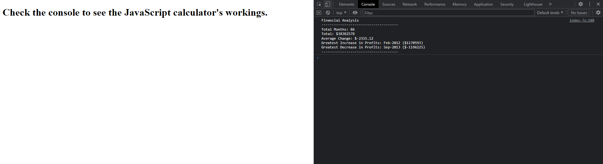

# console-finances

## Deployment

__[Github Repository](https://github.com/jbkennaugh/console-finances)__
__[Deployed Website](https://jbkennaugh.github.io/responsive-css/)__

## Description 

A JavaScript file using the console to organise the finances based on a 2-D array of information.

## Screenshot 

## License

Please refer to the LICENSE in the repository